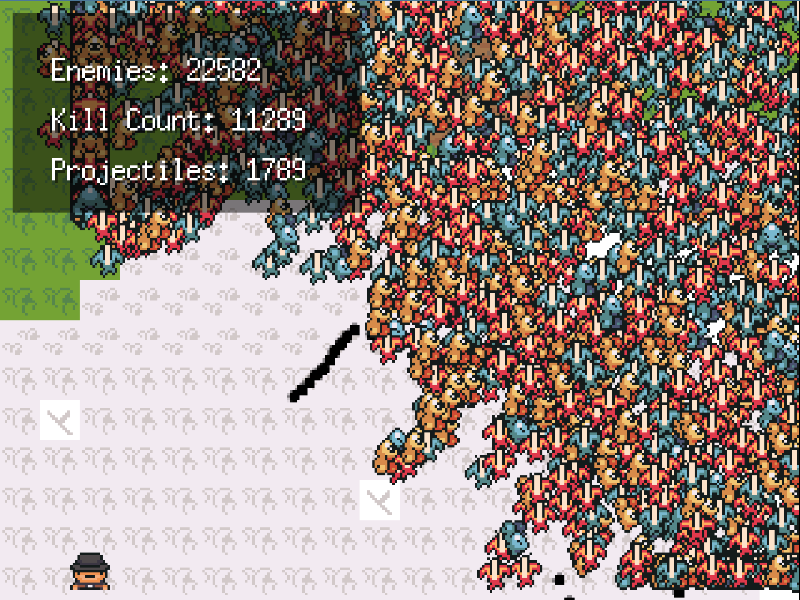

# Simple Game
## Update

I am archiving this project, as many of my initial plans involving highly-parallelized gaming couldn't materialize due to overhead constraints of goroutines, channels, and memory writes (at least using my existing designs).

You can read about my experience trying to build a highly parallelized game with [Ebiten here on my blog](https://thomashansen.xyz/blog/ebiten-and-go.html).

You can also see my dual channel design on my [threading-test branch](https://github.com/thansen0/rl-simple-game/tree/7783efc88a165df6b20d1020240c27bc4244851f) and run it if you'd like using `go run .`.

Originally the plan was to add reinforcement learning logic to enemies, however none of that was implemented.

## Description

This is a demo game I'm working on, primarily to test reinforcement learning as the controller for an enemy.

The game is built with ebitengine and written in Go.
